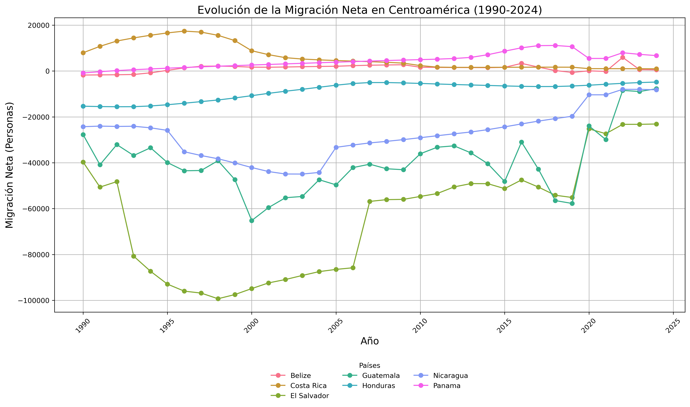
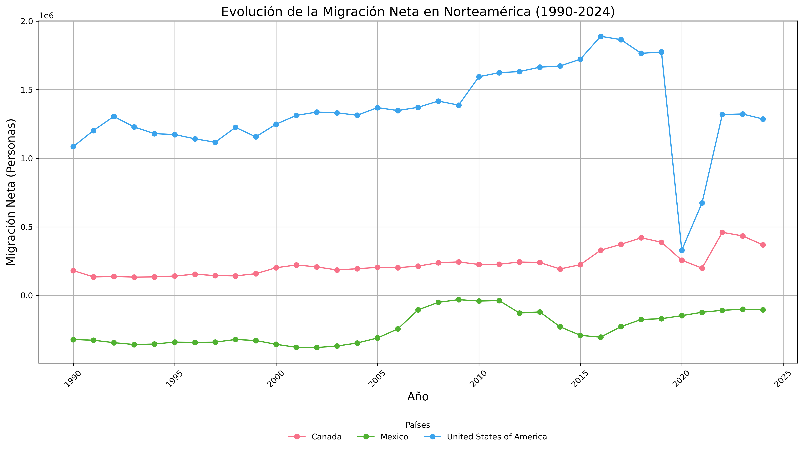
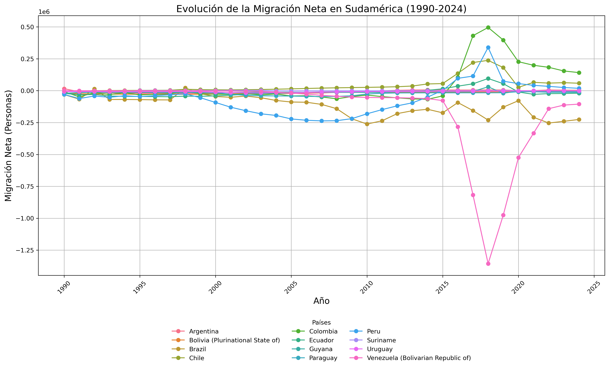

## Situación de la migración 2024

## Evolución de la Migración Neta

### Centroamérica (1990-2024)

### Norteamérica (1990-2024)

### Sudamérica (1990-2024)

### México
- **Intensificación de la represión de migrantes**: Las autoridades mexicanas intensificaron la represión de los migrantes en tránsito por el país, reduciendo significativamente el número de migrantes que llegan a la frontera estadounidense. [Leer más](https://www.americasquarterly.org/article/has-the-central-american-migration-crisis-peaked/#:~:text=Even%20as%20more%20Nicaraguans%20flee%2C%20the%20epicenter%20of,as%20more%20people%20leave%20crisis-torn%20Venezuela%20and%20Ecuador)
- **Salud y migración en Tapachula, Chiapas**: Una ONG en Tapachula, Chiapas, detectó un alto índice de sífilis entre migrantes en la frontera sur de México. Según las pruebas realizadas, tres de cada diez migrantes con acceso a las pruebas diagnósticas tienen sífilis u otras infecciones de transmisión sexual (ITS). [Leer más](https://www.info7.mx/nacional/organizacion-detecta-alto-indice-de-sifilis-en-migrantes/4069012437)

### Colombia y Panamá
- **Muertes de migrantes en la frontera**: El 24 de julio, la policía fronteriza de Panamá (SENAFRONT) confirmó la muerte de diez migrantes en cercanías de un río en una aislada zona de Panamá, próxima a la costa del Caribe colombiano y de la frontera nacional. [Leer más](https://elpaisvallenato.com/diez-migrantes-murieron-ahogados-en-la-frontera-entre-colombia-y-panama/)

### Panamá (Selva del Darién)
- **Violencia sexual en la Selva del Darién**: Durante la primera semana de febrero de 2024, Médicos Sin Fronteras atendió a 113 sobrevivientes de violencia sexual entre los migrantes que atravesaron la selva del Darién, de los cuales 9 eran menores de edad. Esta cifra es la más alta registrada en una sola semana desde 2021. [Leer más](https://www.infobae.com/colombia/2024/02/25/el-darien-es-otro-epicentro-de-violencias-sexuales-se-registro-lacifra-mas-alta-desde-2021/)
- **Proyección de migración**: Se estima que 800,000 migrantes cruzarán la Selva del Darién en 2024, de los cuales 160,000 serían niños o adolescentes, un incremento del 40% en comparación con 2023. Entre enero y abril de 2024, alrededor de 30,000 menores atravesaron esta región, y 2,000 de ellos viajaban sin acompañamiento familiar, triplicando la cifra del año anterior. [Leer más](https://observador.cr/247-ninos-cruzan-el-darien-cada-dia-2024-proyecta-aumenta-del-40-de-menores-migrando/)
  

